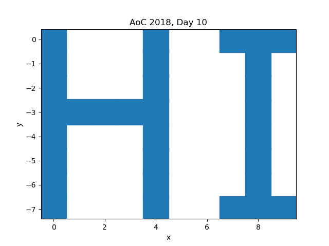
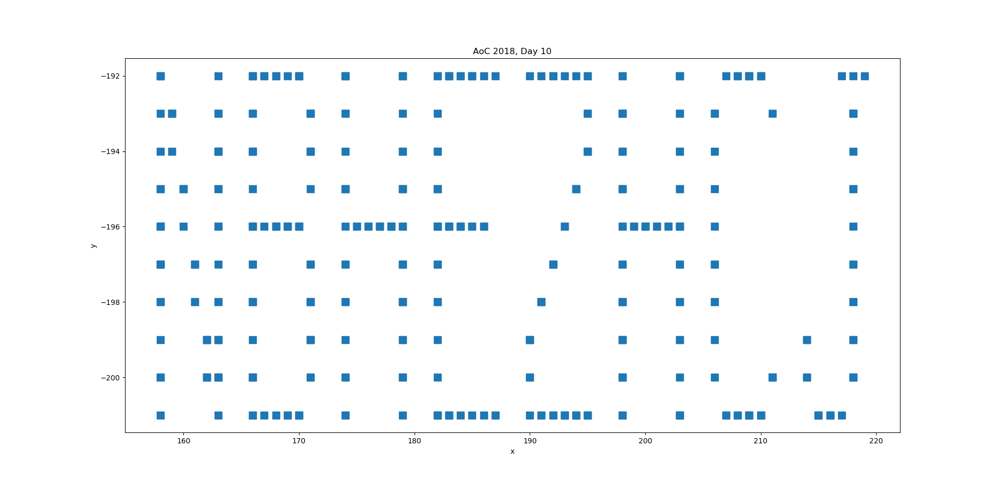

Notes
=====

Link to the exercise: https://adventofcode.com/2018/day/10

First, I made some scatter plots with matplotlib:

example
-------

<p align="center">
  
</p>

input
-----

<p align="center">
  
</p>

Then, I modified my program to produce an ASCII output too:

example
-------

```
#...#..###
#...#...#.
#...#...#.
#####...#.
#...#...#.
#...#...#.
#...#...#.
#...#..###

found after 3 seconds
```

input
-----

```
#....#..#####...#....#..######..######..#....#...####......###
##...#..#....#..#....#..#............#..#....#..#....#......#.
##...#..#....#..#....#..#............#..#....#..#...........#.
#.#..#..#....#..#....#..#...........#...#....#..#...........#.
#.#..#..#####...######..#####......#....######..#...........#.
#..#.#..#....#..#....#..#.........#.....#....#..#...........#.
#..#.#..#....#..#....#..#........#......#....#..#...........#.
#...##..#....#..#....#..#.......#.......#....#..#.......#...#.
#...##..#....#..#....#..#.......#.......#....#..#....#..#...#.
#....#..#####...#....#..######..######..#....#...####....###..

found after 10558 seconds
```

Runtime
-------

Total runtime of `part1and2`: 0.06 sec.
